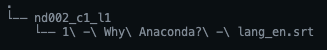

### How to use

* Download the Github repo. The repo contains
  - `transcripts` folder - stores the video transcripts
  - `keywords.txt` - contains the keywords to search for
  - `proccess_subtitles.py` - run this script to search for keywords in the subtitles.
* Download subtitles (.srt) files from classroom resources and put them in the `transcripts` directory.
* The folders inside the `transcript` directory should follow the naming convention described below:
    * If the subtitles are from ND002-Course1-Lesson, then they should reside in the folder named `nd002_c1_l1`. Similarly subtitles from ND229-Course3-Lesson3 will reside in the folder named `nd229_c3_l3`.
    * The `transcripts` folder structure looks as follows

      
    
      In the above image, you can see that the transcripts folder contains one course "ND002-Course1-Lesson1". This course has only 1 video on the page "1 Why Anaconda?"
* Open a terminal and cd to the location of the downloaded Github repo
* (Optional) Open keywords.txt to check the keywords or change keywords.
* To generate the results, execute the command `python process_subtitles.py`.
* The results will be saved in `result.csv`
